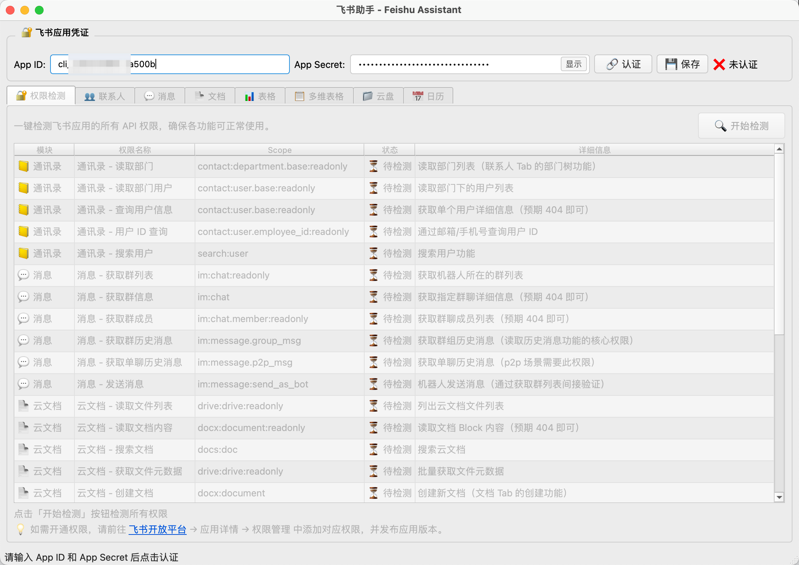
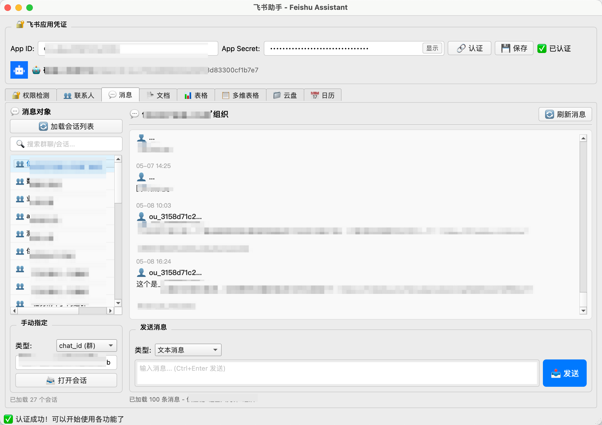
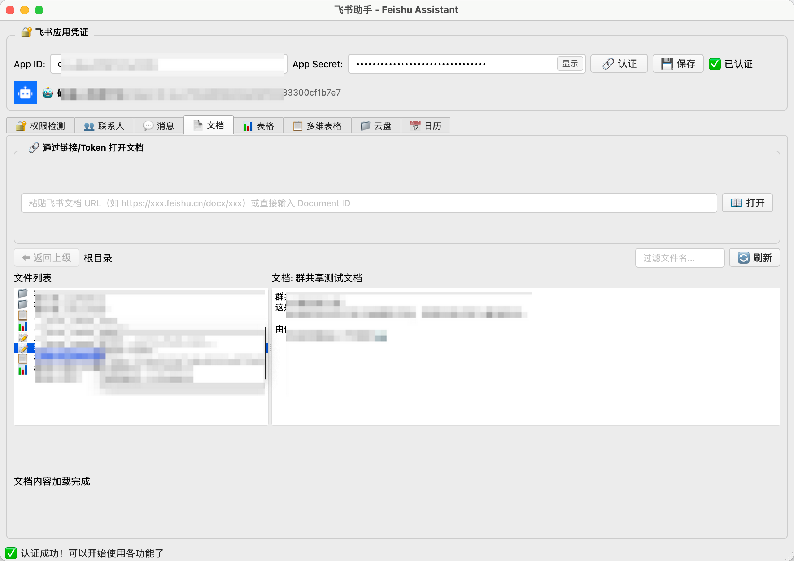
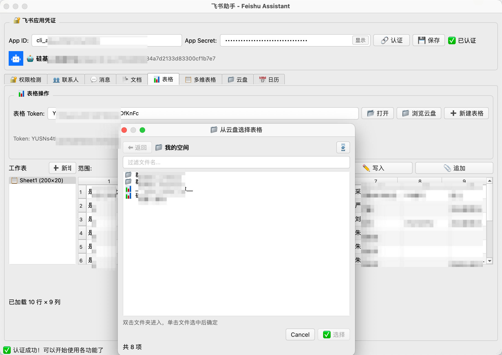
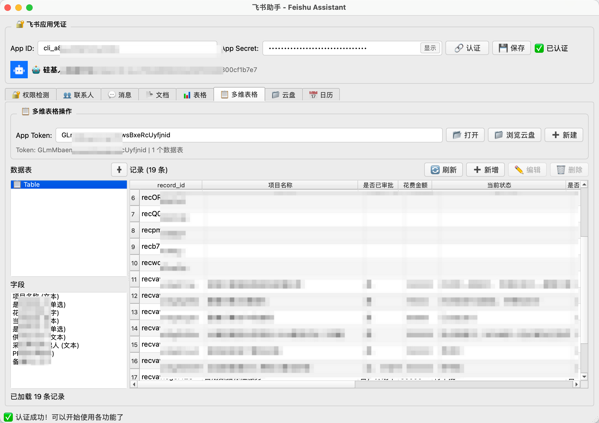
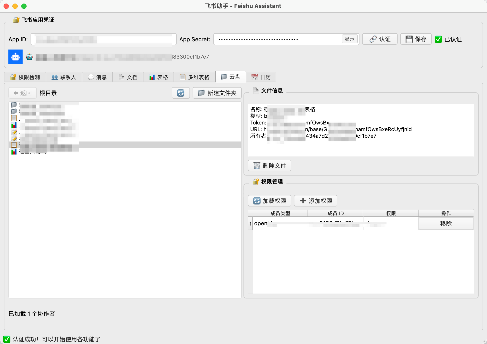
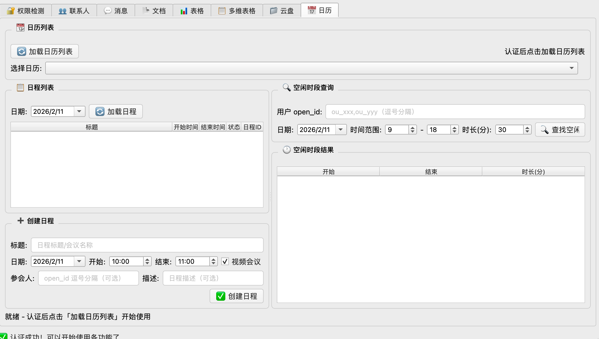

<div align="center">

# 🚀 飞书助手 | Feishu Assistant

**一站式飞书开放平台 GUI 管理工具**

轻量 · 高效 · 开箱即用


[](https://python.org)
[](https://doc.qt.io/qtforpython/)
[](LICENSE)
[]()

[功能特性](#-功能特性) · [快速开始](#-快速开始) · [使用指南](#-使用指南) · [截图预览](#-截图预览) · [常见问题](#-常见问题)

</div>



---

## 📌 项目简介

**飞书助手** 是一款基于 PySide6 构建的桌面端 GUI 应用，为飞书开放平台提供 **可视化操作界面**。无需编写任何代码，即可通过图形界面管理飞书的联系人、消息、文档、表格、多维表格、云盘、日历等核心模块。

无论你是安全测试、飞书应用开发者、企业 IT 管理员，还是需要批量操作飞书数据的运营人员，飞书助手都能显著提升你的工作效率。

---

## ✨ 功能特性

<table>
<tr>
<td width="50%">

### 🔐 权限检测
- 一键检测应用全部 API 权限
- 按模块分类展示检测结果
- 可视化通过/未通过/异常状态
- 提供缺失权限的开通指引

### 👥 联系人管理
- 组织架构部门树浏览
- 部门下用户列表查看
- 多维度用户搜索（姓名/手机号/邮箱）
- 批量获取用户 ID

### 💬 消息收发
- 查看机器人所在的群列表
- 实时加载会话历史消息
- 发送文本 / 富文本 / 卡片消息
- 支持手动指定 open_id / chat_id / email
- 快捷键 `Ctrl+Enter` 发送

### 📄 文档管理
- 云文档文件列表浏览
- 文件夹层级导航
- 支持通过 URL / Token 直接打开
- 文档内容实时预览

</td>
<td width="50%">

### 📊 电子表格
- 创建/打开电子表格
- 工作表列表管理
- 单元格数据读取/写入/追加
- 从云盘浏览选择表格
- 支持 URL 粘贴自动解析 Token

### 📋 多维表格
- 创建/管理多维表格
- 数据表与字段管理
- 记录 CRUD（增删改查）
- 支持复杂字段类型展示
- 云盘文件选择器

### 📁 云盘管理
- 文件夹浏览与创建
- 文件信息查看与删除
- 协作者权限管理（查看/添加/移除）
- 公共分享设置

### 📅 日历管理
- 日历列表查看（主日历/共享日历）
- 日程查看与创建
- 视频会议一键创建
- 多用户空闲时段查询
- 智能会议时间推荐

</td>
</tr>
</table>

---

## 🖼️ 截图预览

<div align="center">

<!-- 主界面截图 -->
| 功能 | 预览 | 说明 |
|------|------|------|
| 🔐 认证与权限检测 |  | 输入凭证即可认证，自动获取应用名称与头像，一键检测全部 API 权限状态 |
| 💬 消息收发 |  | 查看群列表与历史消息，支持发送文本/富文本/卡片消息到群聊或单聊 |
| 📃 文档管理 |  | 浏览云文档列表，单击预览文档内容，双击进入子文件夹，支持 URL 直接打开 |
| 📊 表格操作 |  | 通过链接或云盘选择打开电子表格，支持数据读取、写入与追加操作 |
| 📋 多维表格 |  | 管理多维表格的数据表、字段与记录，支持完整 CRUD 操作 |
| 📁 云盘管理 |  | 浏览云盘文件夹，管理文件权限与协作者，配置公共分享设置 |
| 📅 日历管理 |  | 查看日历与日程，创建日程与视频会议，智能查询空闲时段并推荐会议时间 |

</div>

---

## 🚀 快速开始

### 环境要求

- **Python** 3.10+
- **操作系统**: Windows / macOS / Linux

### 安装步骤

**1. 克隆项目**

```bash
git clone https://github.com/你的用户名/feishu_att.git
cd feishu_att
```

**2. 安装依赖**

```bash
pip install -r requirements.txt
```

> 仅依赖两个包：`PySide6` 和 `requests`，极度轻量！

**3. 启动应用**

```bash
python main.py
```

---

## 📖 使用指南

### 第一步：获取飞书应用凭证

1. 前往 [飞书开放平台](https://open.feishu.cn/) 创建企业自建应用
2. 在应用详情页获取 **App ID** 和 **App Secret**
3. 在 **权限管理** 中开通所需的 API 权限
4. 发布应用版本

### 第二步：认证登录

<!--  -->

1. 启动飞书助手，输入 **App ID** 和 **App Secret**
2. 点击 **🔗 认证** 按钮
3. 认证成功后，应用会显示机器人名称和头像
4. 点击 **💾 保存** 可将凭证保存到本地，下次自动填充

### 第三步：检测权限

建议认证后首先使用 **🔐 权限检测** 功能，一键检查所有 API 权限是否已开通：

- ✅ **通过** — 权限正常
- ❌ **未通过** — 需要在飞书开放平台开通对应权限
- ⚠️ **异常** — 非权限问题，可能需要进一步排查

### 第四步：开始使用

各 Tab 页对应不同的功能模块，按需使用即可。所有操作都在图形界面中完成，无需编写代码。

---


## 🔧 技术特点

| 特性 | 说明 |
|------|------|
| **极简依赖** | 仅需 `PySide6` + `requests`，无重型框架 |
| **异步不阻塞** | 所有 API 请求均通过 `QThread` 异步执行，UI 始终流畅 |
| **Token 自动刷新** | `tenant_access_token` 过期前自动刷新，无需手动干预 |
| **自动分页** | 所有列表接口自动处理分页，获取完整数据 |
| **URL 智能解析** | 粘贴飞书文档/表格 URL 自动提取 Token |
| **本地凭证存储** | App ID / Secret 加密保存到本地，一次配置随时使用 |
| **跨平台运行** | 支持 Windows、macOS、Linux 三大桌面平台 |
| **Fusion 风格** | 统一的 Fusion 样式主题，在各平台呈现一致的现代外观 |

---

## 🔑 所需飞书权限列表

<details>
<summary>点击展开完整权限列表</summary>

| 模块 | 权限 Scope | 说明 |
|------|-----------|------|
| 通讯录 | `contact:department.base:readonly` | 读取部门列表 |
| 通讯录 | `contact:user.base:readonly` | 读取用户信息 |
| 通讯录 | `contact:user.employee_id:readonly` | 通过邮箱/手机号查询用户 |
| 通讯录 | `search:user` | 搜索用户 |
| 消息 | `im:chat:readonly` | 获取群列表 |
| 消息 | `im:chat` | 获取群信息 |
| 消息 | `im:chat.member:readonly` | 获取群成员 |
| 消息 | `im:message.group_msg` | 读取群聊历史消息 |
| 消息 | `im:message.p2p_msg` | 读取单聊历史消息 |
| 消息 | `im:message:send_as_bot` | 发送消息 |
| 云文档 | `drive:drive:readonly` | 读取文件列表 |
| 云文档 | `drive:drive` | 创建文件夹 |
| 云文档 | `docx:document:readonly` | 读取文档内容 |
| 云文档 | `docx:document` | 创建文档 |
| 云文档 | `docs:doc` | 搜索文档 |
| 表格 | `sheets:spreadsheet` | 创建/编辑表格 |
| 表格 | `sheets:spreadsheet:readonly` | 读取表格数据 |
| 多维表格 | `bitable:app` | 创建/编辑多维表格 |
| 多维表格 | `bitable:app:readonly` | 读取多维表格数据 |
| 云盘 | `drive:permission` | 管理文档权限 |
| 日历 | `calendar:calendar:readonly` | 读取日历列表 |
| 日历 | `calendar:calendar` | 创建日程 |
| 日历 | `calendar:calendar:free_busy:readonly` | 查询忙闲状态 |

</details>

> 💡 **提示**：不必一次性开通所有权限，可根据实际需要按模块选择开通。使用内置的「权限检测」功能快速确认权限状态。

---

## ❓ 常见问题

<details>
<summary><b>Q: 认证失败怎么办？</b></summary>

- 确认 App ID 和 App Secret 是否正确
- 确认应用已在飞书开放平台发布版本
- 检查网络连接是否正常
- 如使用代理，确保 `open.feishu.cn` 域名可达

</details>

<details>
<summary><b>Q: 部分功能提示无权限？</b></summary>

- 使用「🔐 权限检测」Tab 检查缺少哪些权限
- 前往 [飞书开放平台](https://open.feishu.cn/) → 应用详情 → 权限管理，开通对应权限
- 开通后需要 **重新发布应用版本** 才能生效

</details>

<details>
<summary><b>Q: 为什么看不到某些群聊？</b></summary>

- 机器人需要被 **添加到群聊** 才能看到该群
- 对于 p2p 单聊，需要用户先与机器人发起过对话

</details>

<details>
<summary><b>Q: 支持飞书国际版 (Lark) 吗？</b></summary>

当前版本默认连接飞书国内版 (`open.feishu.cn`)。如需支持 Lark 国际版，需修改 `api/auth.py` 中的 `BASE_URL` 为 `https://open.larksuite.com/open-apis`。

</details>

<details>
<summary><b>Q: 凭证信息安全吗？</b></summary>

- 凭证保存在本地 `config.json` 文件中（已加入 `.gitignore`）
- 不会上传到任何远程服务器
- App Secret 输入框默认密码模式隐藏，可切换显示

</details>

---

## 🤝 参与贡献

欢迎提交 Issue 和 Pull Request！

1. Fork 本仓库
2. 创建你的特性分支 (`git checkout -b feature/amazing-feature`)
3. 提交更改 (`git commit -m 'Add amazing feature'`)
4. 推送到分支 (`git push origin feature/amazing-feature`)
5. 发起 Pull Request

---

## 📄 许可证

本项目采用 [MIT License](LICENSE) 开源许可证。

---

<div align="center">

**如果这个项目对你有帮助，请给一个 ⭐ Star 支持！**

Made with ❤️ for Feishu/Lark developers

</div>
