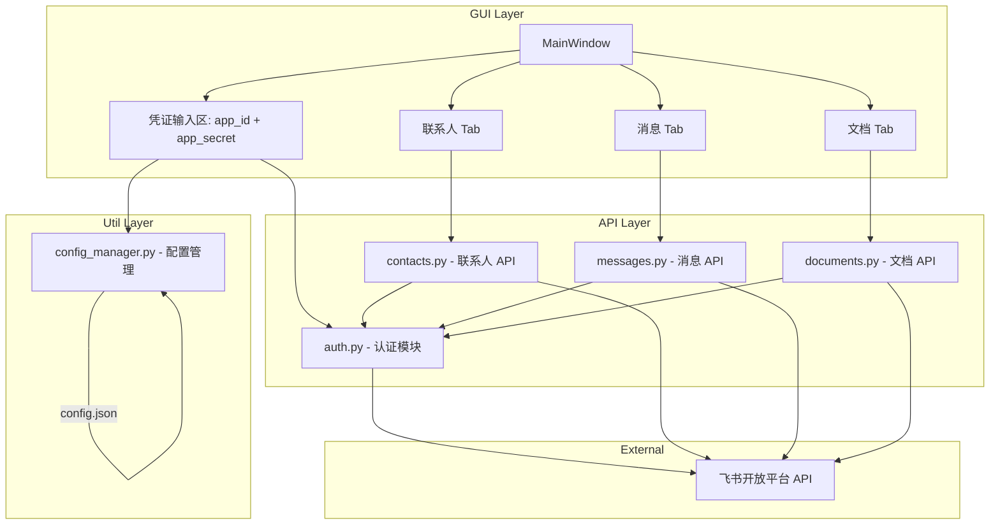
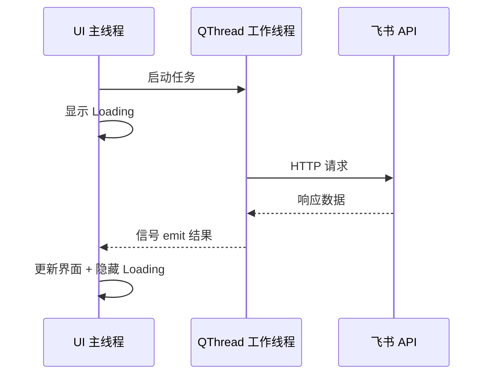

# 飞书助手 GUI 应用 - 架构设计

## 1. 项目概述

基于 Python + PySide6 构建的飞书开放平台 GUI 桌面工具，支持联系人读取、消息发送、文档读取等功能。个人使用。

## 2. 技术栈

| 组件 | 选型 | 说明 |
|------|------|------|
| GUI 框架 | PySide6 | Qt for Python，跨平台，功能丰富 |
| HTTP 客户端 | requests | 简洁易用的 HTTP 库 |
| 配置持久化 | json | 本地 JSON 文件存储凭证 |
| Python 版本 | >= 3.9 | |

## 3. 飞书 API 概览

所有接口基于飞书开放平台 REST API v3：

| 模块 | 接口 | 方法 | 用途 |
|------|------|------|------|
| 认证 | `/auth/v3/tenant_access_token/internal` | POST | 获取 tenant_access_token |
| 联系人 | `/contact/v3/departments` | GET | 获取部门列表 |
| 联系人 | `/contact/v3/users` | GET | 获取用户列表 |
| 联系人 | `/contact/v3/users/batch_get_id` | POST | 通过手机号/邮箱查用户 |
| 消息 | `/im/v1/messages` | POST | 发送消息 |
| 消息 | `/im/v1/chats` | GET | 获取群列表 |
| 文档 | `/drive/v1/files` | GET | 列出云文档 |
| 文档 | `/docx/v1/documents/:document_id/blocks` | GET | 读取文档内容 |

## 4. 项目结构

```
feishu_att/
├── main.py                  # 应用入口
├── requirements.txt         # Python 依赖
├── config.json              # 用户凭证存储（运行时生成，不提交 git）
├── .gitignore
├── plans/
│   └── architecture.md      # 本文件
├── api/
│   ├── __init__.py
│   ├── auth.py              # 认证：获取/刷新 tenant_access_token
│   ├── contacts.py          # 联系人 API 封装
│   ├── messages.py          # 消息 API 封装
│   └── documents.py         # 文档 API 封装
├── ui/
│   ├── __init__.py
│   ├── main_window.py       # 主窗口（凭证输入 + Tab 容器）
│   ├── contacts_tab.py      # 联系人 Tab
│   ├── messages_tab.py      # 消息 Tab
│   └── documents_tab.py     # 文档 Tab
└── utils/
    ├── __init__.py
    └── config_manager.py    # 配置读写工具
```

## 5. 架构图



## 6. 核心模块设计

### 6.1 认证模块 `api/auth.py`

```python
class FeishuAuth:
    BASE_URL = "https://open.feishu.cn/open-apis"
    
    def __init__[app_id, app_secret]:
        self.app_id = app_id
        self.app_secret = app_secret
        self._token = None
        self._token_expire = 0
    
    def get_tenant_access_token[] -> str:
        # 带缓存，过期前自动刷新
        ...
    
    def request[method, path, **kwargs] -> dict:
        # 统一请求方法，自动带 token
        ...
```

**关键点：**
- token 有效期 2 小时，内部缓存 + 自动续期
- 所有其他 API 模块通过 `FeishuAuth.request()` 发请求

### 6.2 联系人 Tab `ui/contacts_tab.py`

**功能：**
- 左侧部门树（树形结构展示）
- 右侧用户列表（选中部门后加载）
- 顶部搜索框（按姓名/手机号搜索）

**UI 布局：**
```
┌─────────────────────────────────────────┐
│ [搜索框]                    [搜索按钮]    │
├──────────────┬──────────────────────────┤
│  部门树       │  用户列表                 │
│  ├ 总公司     │  姓名 | 手机号 | 邮箱     │
│  │ ├ 研发部  │  张三 | 138... | z@..     │
│  │ ├ 市场部  │  李四 | 139... | l@..     │
│  │ └ ...    │  ...                      │
│              │                           │
└──────────────┴──────────────────────────┘
```

### 6.3 消息 Tab `ui/messages_tab.py`

**功能：**
- 选择消息接收对象（用户 open_id 或群 chat_id）
- 消息类型选择（文本 / 富文本 / 卡片）
- 消息内容编辑区
- 发送按钮 + 发送结果反馈

**UI 布局：**
```
┌─────────────────────────────────────────┐
│ 接收类型: [用户▼]  ID: [___________]     │
│ 或选择群: [加载群列表]                    │
├─────────────────────────────────────────┤
│ 消息类型: [文本▼]                        │
├─────────────────────────────────────────┤
│                                         │
│  消息内容编辑区                           │
│                                         │
│                                         │
├─────────────────────────────────────────┤
│                          [发送]          │
│ 状态: 就绪                               │
└─────────────────────────────────────────┘
```

### 6.4 文档 Tab `ui/documents_tab.py`

**功能：**
- 列出用户可访问的云文档（支持分页）
- 选择文档后查看内容预览
- 支持按名称搜索/过滤

**UI 布局：**
```
┌─────────────────────────────────────────┐
│ [搜索/过滤]              [刷新列表]       │
├──────────────┬──────────────────────────┤
│  文档列表     │  文档内容预览              │
│  📄 需求文档  │                           │
│  📄 周报     │  标题: 需求文档             │
│  📊 数据表   │  内容:                     │
│  ...        │  第一章 ...                │
│              │  第二章 ...                │
└──────────────┴──────────────────────────┘
```

### 6.5 配置管理 `utils/config_manager.py`

- 保存 `app_id` 和 `app_secret` 到本地 `config.json`
- 启动时自动加载已保存的凭证
- 凭证以明文存储（个人使用，简化设计）

## 7. 异步处理策略

飞书 API 调用是网络 I/O，直接在主线程调用会导致 UI 冻结。

**方案：使用 `QThread` + 信号槽机制**



每个 Tab 的网络请求都通过 `QThread` 异步执行，避免阻塞 UI。

## 8. 错误处理

- **认证失败**：弹窗提示 app_id/app_secret 错误
- **网络错误**：状态栏显示错误信息 + 重试按钮
- **权限不足**：提示用户在飞书开放平台配置相应权限
- **token 过期**：自动刷新，对用户透明

## 9. 开发步骤

1. 创建项目基础结构、安装依赖
2. 实现认证模块（可独立测试）
3. 实现主窗口框架（凭证输入 + 空 Tab）
4. 逐个实现 Tab 功能（联系人 → 消息 → 文档）
5. 添加配置持久化
6. 整体调试
